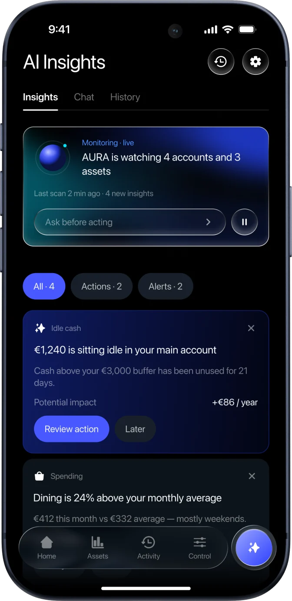
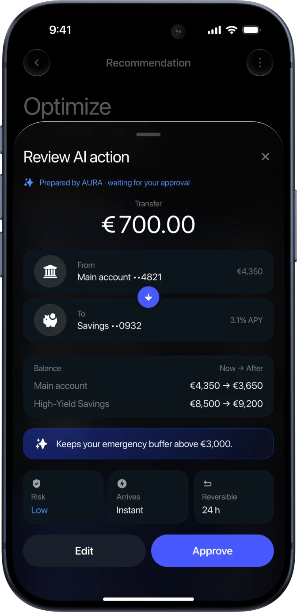
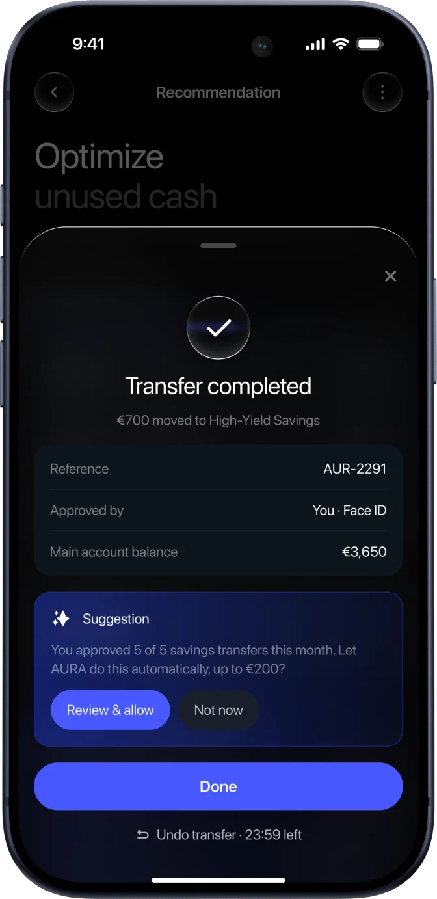
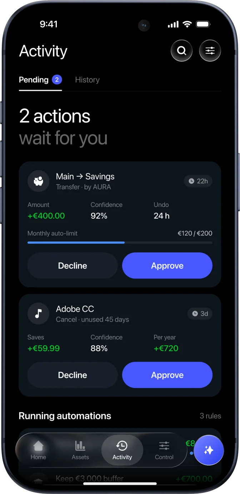
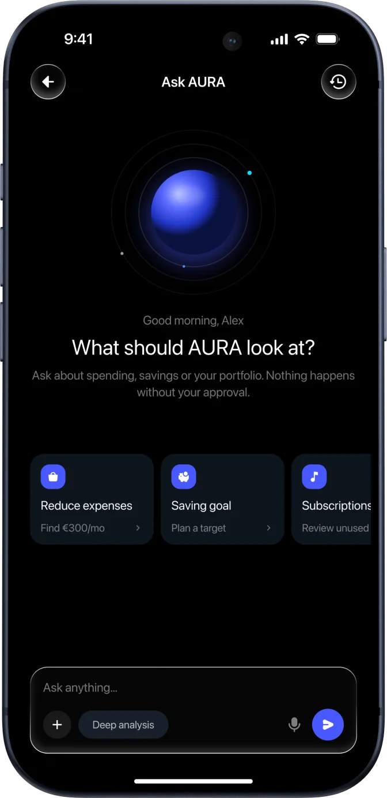
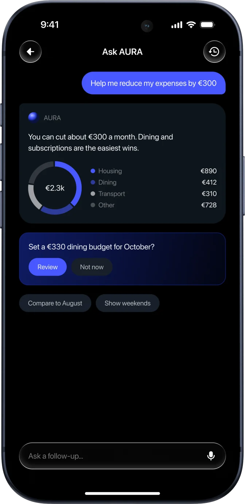
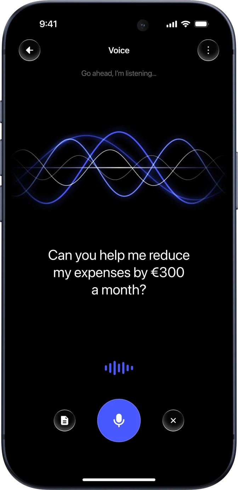
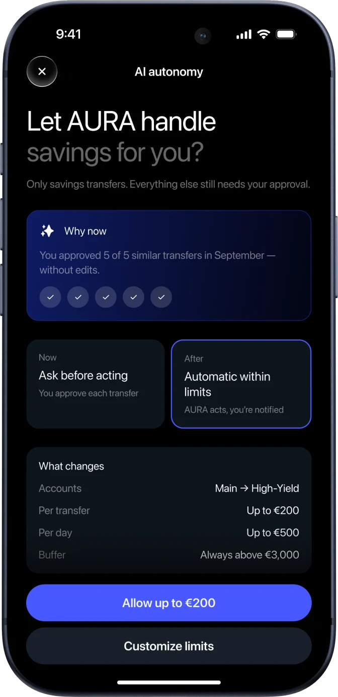
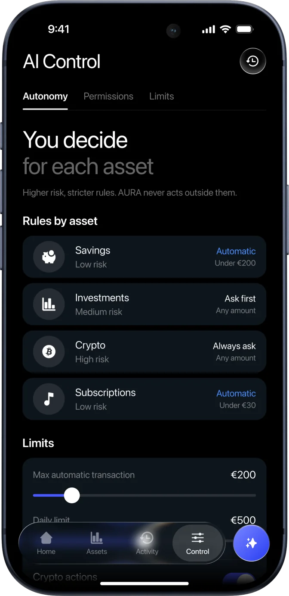
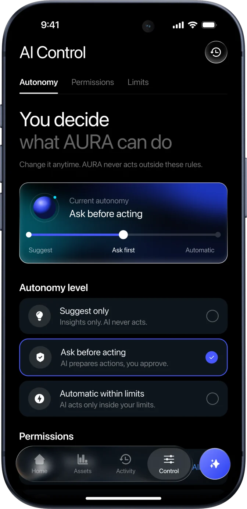

# AURA case — update 01: new mockups in the scrolling gallery

Scope: only the horizontal mockup gallery (`<section class="gallery" id="screens">`). Nothing else changes. Scroll behaviour stays exactly as it is.

## 1. Add files
Copy `assets/g01.webp` … `assets/g14.webp` into the case page's assets folder (same folder as the other AURA images).

## 2. Replace the gallery row markup
Inside `.gallery-row`, replace all existing `<div class="phone">…</div>` items with:

```html














```

The images already contain the iPhone frame and have transparent corners, so they must not get the old `.phone` frame, border-radius or shadow.

## 3. CSS
In the case stylesheet replace:

```css
.gallery-row .phone{height:min(70svh,640px);flex:none;box-shadow:0 0 0 1px rgba(255,255,255,.22);transition:transform .5s var(--ease)}
.gallery-row .phone:hover{transform:translateY(-8px)}
```

with:

```css
.gallery-row .mock{height:min(72svh,660px);width:auto;max-width:none;flex:none;transition:transform .5s var(--ease)}
.gallery-row .mock:hover{transform:translateY(-8px)}
```

## 4. Do not change
- The gallery JS and pinned horizontal scroll.
- Any other section, copy or asset.
- Old `m-*.webp` files are still used by the Core experience section: do not delete them.

## Check
At 1440 px the row still moves horizontally while scrolling the page; at 390 px it is a native swipe. No horizontal page scroll. No 404s.
